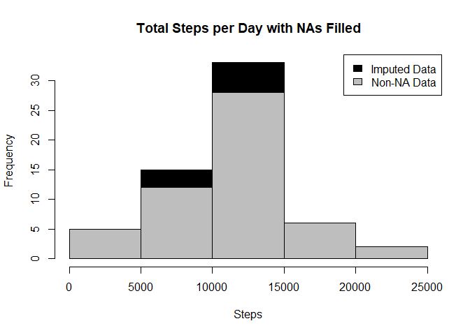

## Set Global Options 

```r
   library(knitr)
   opts_chunk$set(echo=TRUE,results="hide")
```

## Loading and preprocessing the data

### Download and unzip the data


```r
  setwd("~/Coursera/Reproducible Research/Week 2")
  url1 <- "https://d396qusza40orc.cloudfront.net/repdata%2Fdata%2Factivity.zip"
  destfile1 <- "repdata_data_activity.zip"
  
  if(!file.exists(destfile1)) {
      download.file(url1, 
                    destfile = destfile1, 
                    method = "curl")
      unzip(destfile1, exdir = "./Data")
  }
```

### Read the data

```r
  setwd("~/Coursera/Reproducible Research/Week 2")
  activity <- read.csv("Data/activity.csv")
  #str(activity)
  #names(activity)
  #head(activity)
```

### Process the data

```r
  # Format Date
  activity$day <- weekdays(as.Date(activity$date))
  activity$DateTime<- as.POSIXct(activity$date, format="%Y-%m-%d")
  #activity$DateOnly <- as.Date(activity$date, format="%Y-%m-%d")
```

## What is mean total number of steps taken per day?

```r
  library(dplyr)
```

```
## 
## Attaching package: 'dplyr'
```

```
## The following objects are masked from 'package:stats':
## 
##     filter, lag
```

```
## The following objects are masked from 'package:base':
## 
##     intersect, setdiff, setequal, union
```

```r
  #Compute total number of steps per day
  tot.steps.per.day <- activity[!is.na(activity$steps),] %>% group_by(date) %>%
     summarize(totalSteps = sum(steps, na.rm = TRUE))
```

```
## `summarise()` ungrouping output (override with `.groups` argument)
```

```r
  #This keeps rows for all dates even ones with NAs with total 0
  #tot.steps.per.day <- activity %>% group_by(date) %>%
  #    summarize(totalSteps = sum(steps, na.rm = TRUE))
```


```r
  #Plot Histogram
  hist(tot.steps.per.day$totalSteps, breaks=5, xlab="Steps", main = "Total Steps per Day")
```

<!-- -->


```r
  #Mean Steps
  mean1 <- as.integer(mean(tot.steps.per.day$totalSteps))
  
  #Median Steps
  median1 <- as.integer(median(tot.steps.per.day$totalSteps))
```

The **mean number** of steps taken per day was **10766**.  
The **median number** of steps taken per day was **10765**.  

## What is the average daily activity pattern?


```r
  #Create average number of steps per interval
  avg.steps.per.interval <- activity[!is.na(activity$steps),] %>% group_by(interval) %>% 
  summarize(avgSteps = mean(steps, na.rm = TRUE))
```

```
## `summarise()` ungrouping output (override with `.groups` argument)
```


```r
  #Create line plot of average number of steps per interval
  library(ggplot2)
  p <- ggplot(avg.steps.per.interval, aes(x=interval, y=avgSteps), xlab = "Interval", ylab="Average Number of Steps")
  p + geom_line()+xlab("Interval")+ylab("Average Number of Steps")+ggtitle("Average Number of Steps per Interval")
```

<!-- -->


```r
  #Maximum steps by interval
  maxSteps <- max(avg.steps.per.interval$avgSteps)
  
  #Which interval contains the maximum average number of steps
  intervalWithMaxSteps <- avg.steps.per.interval[avg.steps.per.interval$avgSteps==maxSteps,1]
```

The **maximum** steps for a 5 minute interval was **206.1698113** steps.   
The 5 minute interval with **maximum** number of steps is interval **835**.  

## Imputing missing value


```r
  #Number of NAs in activity data
  rowsWithNA <- nrow(activity[is.na(activity$steps),])
```
There are **2304** rows with NAs in the activity data.  


```r
  #Create Data with no NAs
  activityNoNA <- activity[!is.na(activity$steps),]
  #head(activityNoNA)

  #Create the average number of steps per weekday and interval
  avgTable <- activity[!is.na(activity$steps),] %>% group_by(interval, day) %>%
  summarize(avgStepsComputed = mean(steps, na.rm = TRUE))
```

```
## `summarise()` regrouping output by 'interval' (override with `.groups` argument)
```

```r
  #Create data with NAs for substitution
  activityNA <- activity[is.na(activity$steps),]
  
  #Merge NA data with average weekday interval for substitution
  filledData1<-merge(activityNA, avgTable, by=c("interval", "day"))

  #Reorder the new substituted data in the same format as clean data set
  filledData2<- filledData1[,c(6,4,1,2,5)]
  colnames(filledData2)<- c("steps", "date", "interval", "day", "DateTime")

  #Merge the NA averages and non NA data together
  filledDataAll <- rbind(activityNoNA, filledData2)

  ##Create sum of steps per date to compare with step 1
  tot.steps.per.day2 <- filledDataAll %>% group_by(date) %>%
    summarize(totalSteps = sum(steps, na.rm = TRUE))
```

```
## `summarise()` ungrouping output (override with `.groups` argument)
```


```r
  # Creating the histogram of total steps per day, categorized by data set to show impact
  hist(tot.steps.per.day2$totalSteps, breaks=5, xlab="Steps", main = "Total Steps per Day with NAs Filled", col="Black")
  hist(tot.steps.per.day$totalSteps, breaks=5, xlab="Steps", main = "Total Steps per Day with NAs Filled", col="Grey", add=T)
  legend("topright", c("Imputed Data", "Non-NA Data"), fill=c("black", "grey") )
```

<!-- -->


```r
  # Mean of Steps with NA data imputed
  mean2 <- as.integer(mean(tot.steps.per.day2$totalSteps))

  # Median of Steps with NA data imputed
  median2 <-as.integer(median(tot.steps.per.day2$totalSteps))
```
The **mean number** of steps taken per day after imputing missing data was **10821**.    
The **median number** of steps taken per day after imputing missing data was **11015**.   

## Are there differences in activity patterns between weekdays and weekends?


```r
  #Create new category based on the days of the week
  filledDataAll$dayType <- ifelse(filledDataAll$day %in% c("Saturday", "Sunday"), "Weekend", "Weekday")
  filledDataAll$dayType <- as.factor(filledDataAll$dayType)
  #str(filledDataAll)
  
  #Summarize data by interval and type of day
  avg.steps.per.interval.and.dayType <- filledDataAll %>% group_by(interval, dayType) %>%
  summarize(avgSteps = mean(steps, na.rm = TRUE))
```

```
## `summarise()` regrouping output by 'interval' (override with `.groups` argument)
```


```r
  #Plot data in a panel plot
  library(lattice)
  xyplot(avgSteps~interval|dayType, data=avg.steps.per.interval.and.dayType, type="l",  layout = c(1,2),
       main="Average Steps per Interval Based on Type of Day", 
       ylab="Average Number of Steps", xlab="Interval")
```

<!-- -->
